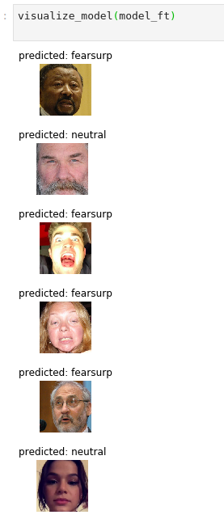

# fearclassifier
Crowd fear classifier on FMV

#Introduction
Development of a very simple prototype for collective fear detection on YouTube videos. Uses the basic OpenCV haarcascade, a simple CNN, and was trained on data from the AffectNet database. The pre-trained model is available <a href="https://umbc.box.com/s/fty8xtwbjyui5maxwwtaubz7x8u03thh">here.</a>

#Data
AffectNet database, obtained with permission from Ali Mollahosseini, Behzad Hasani, and Mohammad H. Mahoor, “AffectNet: A New Database for Facial Expression, Valence, and Arousal Computation in the Wild”, IEEE Transactions on Affective Computing, 2017. URL - http://mohammadmahoor.com/affectnet/

<h2>Preprocessing</h2>
added soon

<h2>Version 1</h2>
<h3>Data Classification</h3>
- Fear = 6,398 images (Expression == 4)
- Neutral = randomly split from sample into 6,398 images (Expression == 0)

<h3>Classifier</h3>
CNN in Pytorch:

    def forward(self, x):
        x = F.relu(self.conv1(x))
        x = self.pool(F.relu(self.conv2(x)))
        x = self.pool(F.relu(self.conv3(x)))
        x = F.relu(self.conv4(x))
        x = x.view(-1, 184 * 24 * 24)
        x = F.relu(self.fc1(x))
        x = F.relu(self.fc2(x))
        x = self.fc3(x)
        return x

<h3>Evaluation</h3>
The current model is 71% on validation, 78% on test.

<h3>Demo FMV</h3>
<a href="https://vimeo.com/397697090">https://vimeo.com/397697090</a>

<h2>Version 2</h2>
<h2>Data Classification</h2>
- Combination of Fear and Surprise = 20,468 images (Expression == 4 + Expression ==3)
- Neutral = randomly split from sample into 20,468 images (Expression == 0)

<h2>Mean expression calculations</h2>
Takes the mean value of the fear probability for all faces on the given frame, saves to outfile.

<h3>Classifier</h3>
ResNet-18, from TorchVision, pretrained=True

data transforms:

    data_transforms = {
    'train': transforms.Compose([
        transforms.RandomResizedCrop(224),
        transforms.RandomHorizontalFlip(),
        transforms.ToTensor(),
        transforms.Normalize([0.485, 0.456, 0.406], [0.229, 0.224, 0.225])
    ]),
    'val': transforms.Compose([
        transforms.Resize(256),
        transforms.CenterCrop(224),
        transforms.ToTensor(),
        transforms.Normalize([0.485, 0.456, 0.406], [0.229, 0.224, 0.225])

  loss and optimizer:

    criterion = nn.CrossEntropyLoss()

    optimizer_ft = optim.SGD(model_ft.parameters(), lr=0.001, momentum=0.9)

    # Decay LR by a factor of 0.1 every 7 epochs
    exp_lr_scheduler = lr_scheduler.StepLR(optimizer_ft, step_size=7, gamma=0.1)
    ]),
    }

  trained 5 epochs

<h3>Evaluation</h3>

    Epoch 0/4
    -----
    train Loss: 0.3904 Acc: 0.8203
    val Loss: 0.3640 Acc: 0.8427

    Epoch 1/4
    ----------
    train Loss: 0.3878 Acc: 0.8213
    val Loss: 0.3916 Acc: 0.8290

    Epoch 2/4
    ----------
    train Loss: 0.3491 Acc: 0.8412
    val Loss: 0.3180 Acc: 0.8595

    Epoch 3/4
    ----------
    train Loss: 0.3430 Acc: 0.8442
    val Loss: 0.3021 Acc: 0.8615

    Epoch 4/4
    ----------
    train Loss: 0.3377 Acc: 0.8476
    val Loss: 0.3090 Acc: 0.8635

Training complete in 19m 51s 
Best val Acc: 0.863500

